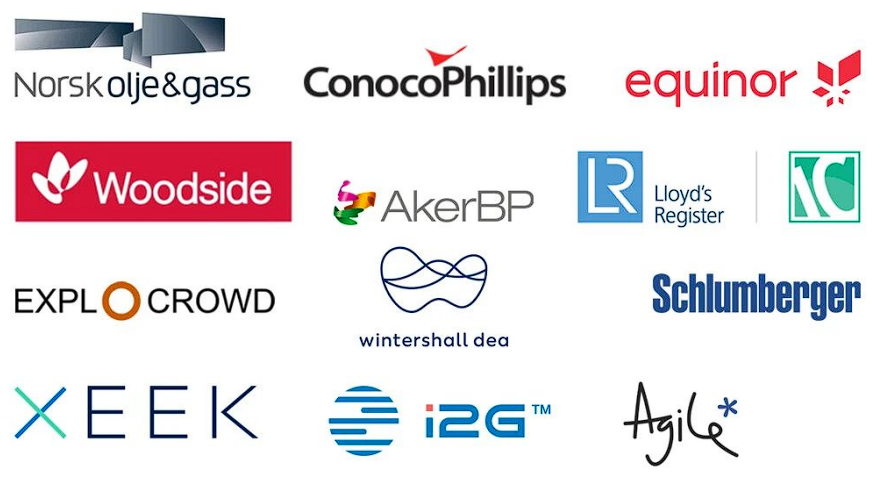
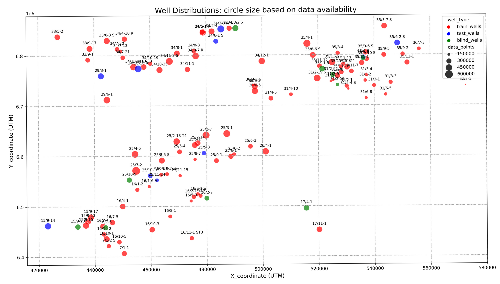
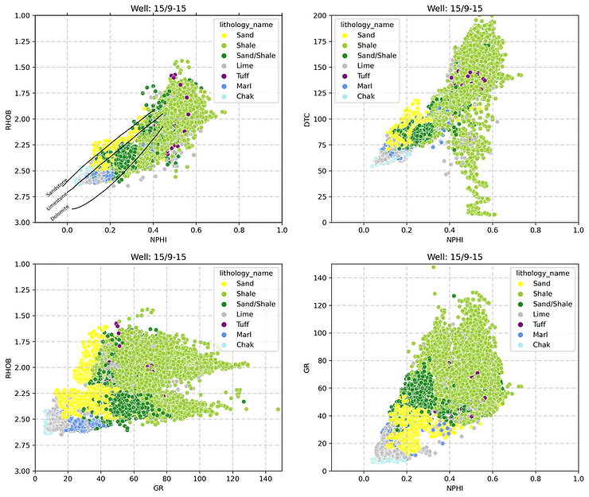
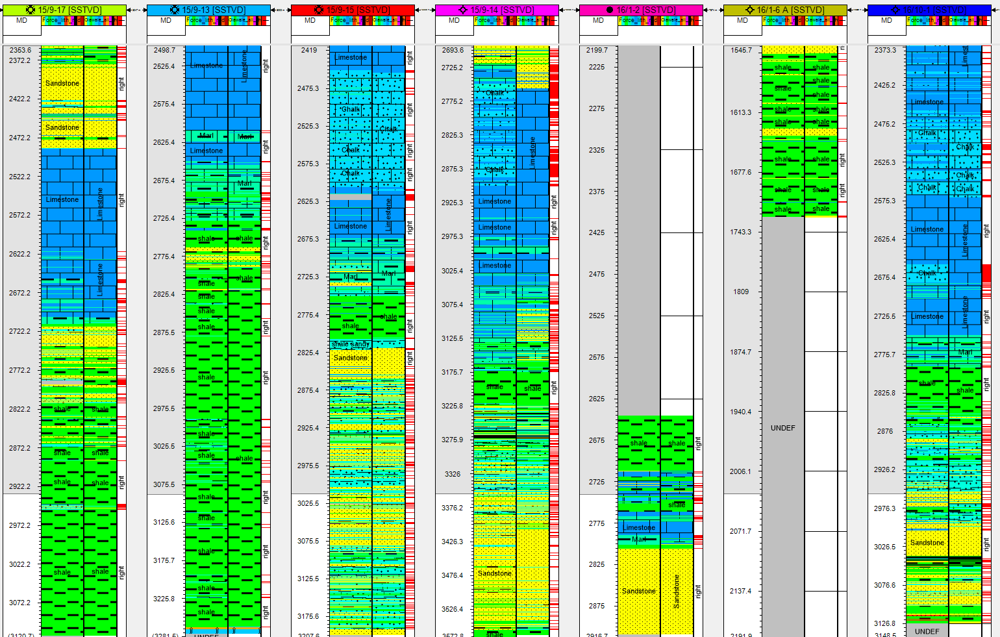
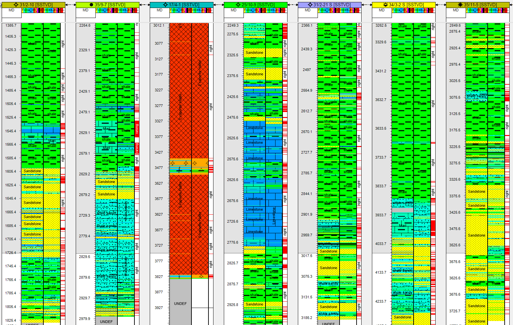

# Lithofacies Prediction

This repository contains code for building a custom production/inference-ready lithofacies classification model. 

The training data set used contains >1 million instances of well logs, 12 lithology classes, NPD lithostratigraphy, and well X, Y position. Overall three (3) datasets were provided, each with different lithology distribution to purposely penalize models that overfit the training set.



## Data
The dataset contains 118 well data in total, 98 aimed for training, 10 for testing, and the rest as blind well data from offshore Norway. In addition, well coordinates and interpreted lithofacies and lithostratigraphy, these well log measurements are also included: CALI, RDEP, RHOB, DHRO, SGR, GR, RMED, RMIC, NPHI, PEF, RSHA, DTC, SP, BS, ROP, DTS, DCAL, MUDWEIGHT. Except for GR and depth, other logs have missing values that were taken care of during the preparation process.

The figure below shows the geographical locations of the wells. Train wells are in red, test in blue, and blind wells in green.

**Well Locations**

**Cross Plots**



## Project Organization 
This project is organized into the following directories:
- `data`: contains custom penalty matrix for model evaluation. [link to full dataset](https://github.com/bolgebrygg/Force-2020-Machine-Learning-competition/tree/master/lithology_competition/data)
- `notebooks`: contains notebooks for experimentation, and sub-folder for custom mlflow model
- `src`: contains python executable scripts

## Getting Started
To replicate this repo, or use it as a basis for experimentation.

1. git clone this repo
2. download the [data](https://github.com/bolgebrygg/Force-2020-Machine-Learning-competition/tree/master/lithology_competition/data) and extract to the ```./data``` directory
3. experiment

## Custom XGboost MLFlow model performance on the three (3) evaluated datasets

| Evaluated dataset | Custom Score (penalty matrix) | f1-score (weighted) |
|----------|----------|----------|
| Train | - 0.2969 | 88.3 % |
| Test set  | - 0.5375 | 77.5 % |
| Blind test set | - 0.4627 | 80.0 % |


### Well logs


